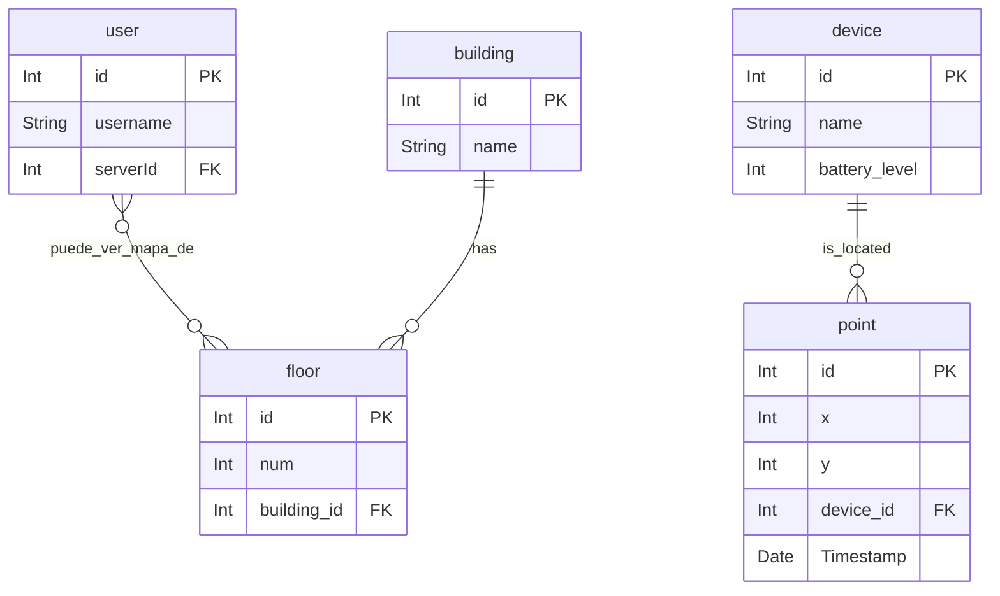

```mermaid
erDiagram
    user {
        Int id PK
        String username
        Int serverId FK
    }

 
    user }o--o{ floor : puede_ver_mapa_de


    building {
        Int id PK
        String name
    }

    floor {
        Int id PK
        Int num
        Int building_id FK
    }
    building ||--o{ floor : has

    device {
        Int id PK
        String name
        Int battery_level
    }

    point {
        Int id PK
        Int x
        Int y
        Int device_id FK
        Date Timestamp 
    }
    device ||--o{ point : is_located

```
