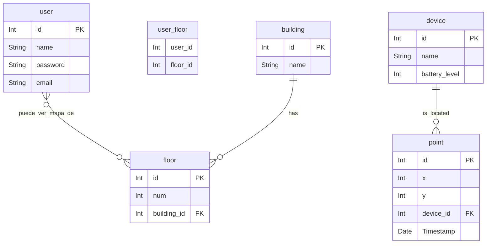

* Relaciones 1-* con FK en tabla *
* Relaciones *-* con tabla auxiliar con indices de tablas
* SQLAlchemy se encarga de crear estas tablas si se definene las relaciones *-* correctamente en models.py
 
