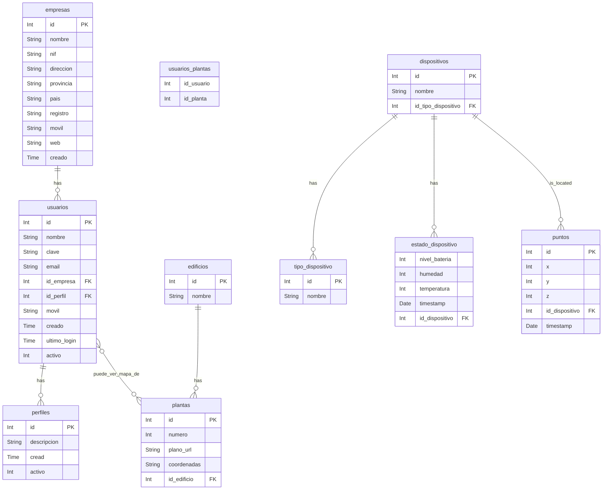

* Relaciones 1-M con FK en tabla *
* Relaciones M-M con tabla auxiliar con indices de tablas
* SQLAlchemy se encarga de crear estas tablas si se definene las relaciones M-M correctamente en models.py
 
